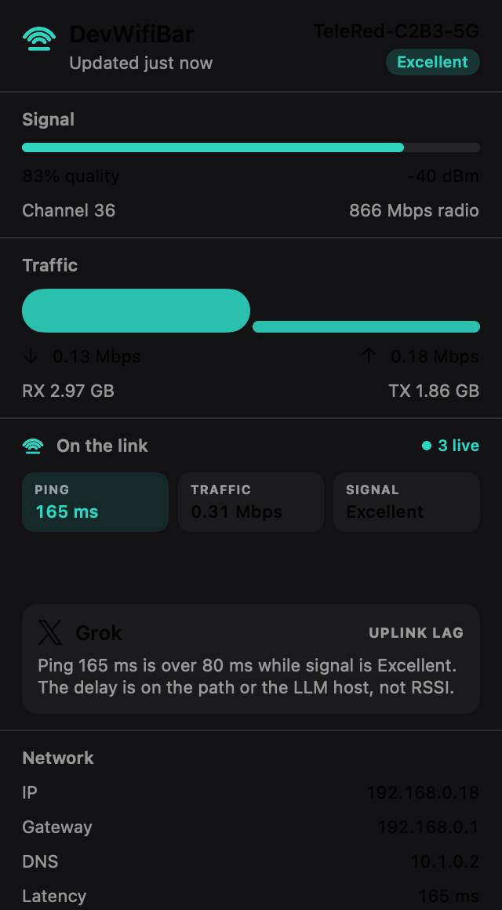
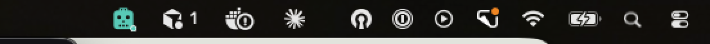

<p align="center">
  
</p>

<h1 align="center">DevWifiBar</h1>

<p align="center">
  Live Wi-Fi in the macOS menu bar. When an LLM fills the pipe, you’ll know why the ping moved.
</p>

<p align="center">
  <a href="https://github.com/tomymaritano/devwibar/releases/latest"></a>
  
  
</p>

```bash
brew tap tomymaritano/tap
brew install --cask devwibar
```

Native Swift. No Electron. No Dock icon. Same idea as the [`devwifi`](https://github.com/tomymaritano/devwifi) CLI — always visible, one click deep.

<p align="center">
  
</p>

<p align="center">
  
</p>

## What you get

**Menu bar** — a wifi-on-a-bar mark. Template white, native. Click it.

**Signal** — RSSI quality (Excellent / Good / Fair / Weak), channel, radio rate. Same cutoffs as `devwifi`.

**Traffic** — live RX/TX in Mbps, sparkline, session totals.

**On the link** — LLM Connection Radar. It attributes traffic to AI apps already on your Mac (Cursor, Claude, Grok, ChatGPT, Copilot, Gemini, Windsurf, Ollama, Perplexity) and says whether lag is Wi-Fi or an LLM saturating the uplink.

Evidence is three chips — Ping, Traffic, Signal — plus a one-line reason with numbers. No slogan rewrite. Process names and destinations only; nothing inside TLS.

**Network** — IP, gateway, DNS (Cloudflare / Google / Quad9 / OpenDNS labels), latency to 1.1.1.1. Click a value to copy.

**Footer** — Open at login, Quit.

## Install

### Homebrew

```bash
brew tap tomymaritano/tap
brew install --cask devwibar
open -a DevWifiBar
```

The cask lives in [`tomymaritano/homebrew-tap`](https://github.com/tomymaritano/homebrew-tap). Upgrade with `brew upgrade --cask devwibar`.

v0.1.0 is ad-hoc signed. If Gatekeeper blocks the first launch: right-click DevWifiBar → Open.

### From source

macOS 14+ and Swift 5.10+ (Xcode 15.4 or later).

```bash
git clone https://github.com/tomymaritano/devwibar.git
cd devwibar
./Scripts/package_app.sh
open dist/DevWifiBar.app
```

`make package` is the same. `UNIVERSAL=1 make package` builds arm64 + x86_64.

## Permissions

| Access | Why |
| --- | --- |
| **Location** | Apple only exposes SSID / BSSID through CoreWLAN + CoreLocation. Asked once. Without it the panel still shows RSSI, IP, traffic, DNS, and latency; the name stays “Wi-Fi”. |
| **lsof / nettop** | Radar maps process names to known LLM hosts. No packet payloads, no keychain, no prompts. |

System Settings → Privacy & Security → Location Services → DevWifiBar.

## How it works

| Data | Source |
| --- | --- |
| SSID, RSSI, channel, BSSID | CoreWLAN |
| SSID permission | CoreLocation |
| Path up/down | Network.framework (`NWPathMonitor`) |
| RX / TX bytes | `getifaddrs` interface counters |
| IP / gateway / DNS | `ipconfig`, `route`, `SCDynamicStore` |
| Latency | `ping` to 1.1.1.1 |
| AI apps on the link | `lsof` + `nettop`, matched against [`AICatalog`](Sources/DevWifiCore/AICatalog.swift) |

`DevWifiCore` is the readers. `DevWifiBar` is an `LSUIElement` AppKit status item + SwiftUI popover.

Radar rules (with hysteresis): latency is high above **80 ms** and clears below **60 ms**; saturate above **2.5 Mbps** and clears below **1.6 Mbps**. If ping is high and signal is Excellent, the verdict is uplink / LLM host — not RSSI.

## Development

```bash
swift test
swift build -c release --product DevWifiBar
make package
```

GitHub Actions (`macos-14`) runs tests and uploads the `.app` + zip on every push to `main`.

## Phase 2

Password reveal, QR share, speed test, DNS switching, device scan, and alerts stay in the [`devwifi`](https://github.com/tomymaritano/devwifi) CLI for now.

## License

MIT. Provider marks in the radar are [Simple Icons](https://simpleicons.org) (CC0); trademarks belong to their owners.
